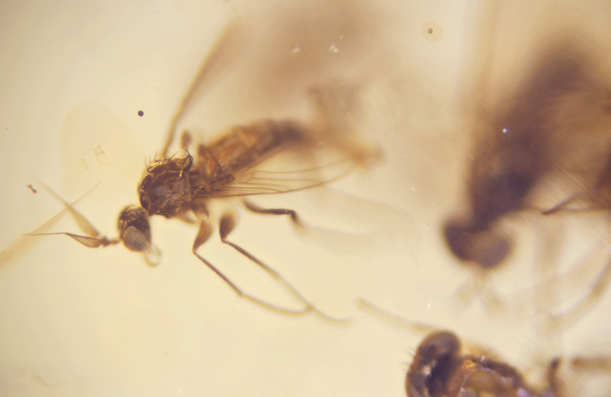
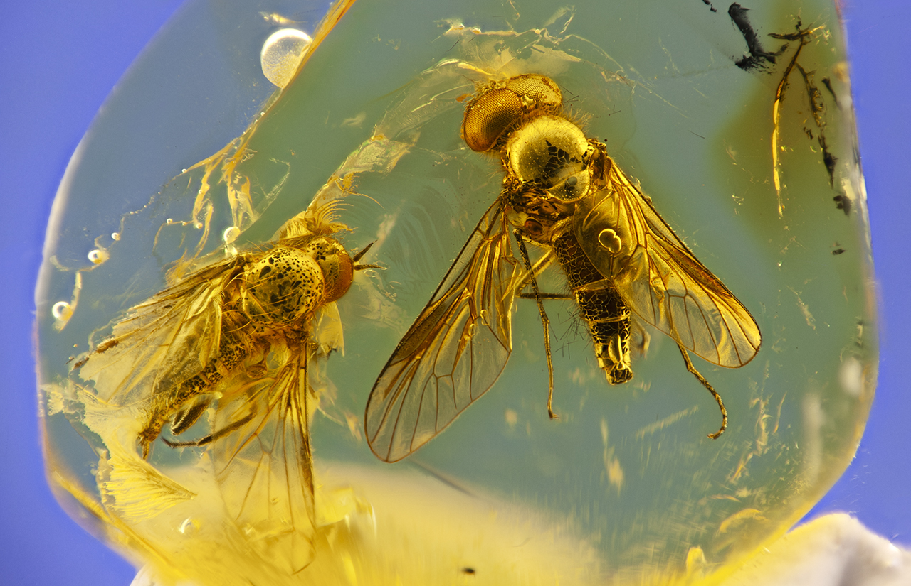

# Focus stacking framework

  

### Usage example with jupyter notebook:

```python
from focus_stack import *
job = StackJob("job", "E:/Focus stacking/My image directory/", input_path="source")
job.add_action(MultiRefActions("align", actions=[AlignLayers(),
                                                 Balance(LumiCorrection(mask_size=0.8, i_min=150, i_max=65385))]))
job.add_action(FocusStackBunch("batches", PyramidStack(), frames=10, overlap=2, denoise=0.8))
job.add_action(FocusStack("stack", PyramidStack(), postfix='_py', denoise=0.8))
job.add_action(FocusStack("stack", DepthMapStack(), input_path='batches', postfix='_dm', denoise=0.8))
job.add_action(MultiLayer("multilayer", input_path=['batches', 'stack']))
job.run()
```
### Requirements

* python version 3.10 or greater

The following python modules:
* open cv (opencv-python)
* numpy
* scipy
* matplotlib
* termcolor
* tqdm
* PIL (pillow)

## Documentation

Schedule the desired actions in a job, then run the job.

### Job creation

```python
job = StackJob(name, working_directory)
```

arguments are:
* ```working_directory```: the directory that contains input and output images, organized in subdirectories as specified by each action
* ```name```: the name of the job, used for printout
* ```input_path``` (optional): the subdirectory within ```working_directory``` that contains input images for subsequent action. If not specified, at least the first action must specify an ```input_path```.

### Schedule multiple actions based on a reference image: align and/or balance images

```python
job.add_action(MultiRefActions(name, actions=[...], *options))
```

* ```name```: the name of the action, used for printout, and possibly for output path
* ```actions```: array of action object to be applied in cascade 
* ```input_path``` (optional): the subdirectory within ```working_directory``` that contains input images to be processed. If not specified, the last output path is used, or, if this is the first action, the ```input_path``` specified with the ```StackJob``` construction is used. If the ```StackJob``` specifies no ```input_path```, at least the first action must specify an  ```input_path```.
* ```output_path``` (optional): the subdirectory within ```working_directory``` where aligned images are written. If not specified,  it is equal to  ```name```.
* ```resample``` (optione, default: 1): take every *n*<sup>th</sup> frame in the selected directory. Default: take all frames.
* ```ref_idx``` (optional): the index of the image used as reference. Images are numbered starting from zero. If not specified, it is the index of the middle image.
* ```step_process``` (optional): if equal to ```True``` (default), each image is aligned with respect to the previous or next image, depending if it is after or befor the reference image.

### Image registration: scale, tanslation and rotation correction, or full perspective correction

```python
AlignLayers(*options)
```
arguments are:
* ```transform``` (optional): the transformation applied to register images. Possible values are:
  * ```ALIGN_RIGID``` (default): allow scale, tanslation and rotation correction. This should be used for image acquired with tripode or microscope.
  * ```ALIGN_HOMOGRAPHY```: allow full perspective correction. This should be used for images taken with hand camera.
* ```detector``` (optional): the feature detector is used to find matches. See [Feature Detection and Description](https://docs.opencv.org/4.x/db/d27/tutorial_py_table_of_contents_feature2d.html) for more details. Possible values are:
  * ```SIFT``` (default): [Scale-Invariant Feature Transform](https://docs.opencv.org/4.x/da/df5/tutorial_py_sift_intro.html)]
  * ```ORB```: [Oriented FAST and Rotated BRIEF](https://docs.opencv.org/4.x/d1/d89/tutorial_py_orb.html)
  * ```SURF```: [Speeded-Up Robust Features](https://docs.opencv.org/3.4/df/dd2/tutorial_py_surf_intro.html)
  * ```AKAZE```: [AKAZE local features matching](https://docs.opencv.org/3.4/db/d70/tutorial_akaze_matching.html)
* ```descriptor``` (optional): the feature descriptor is used to find matches. Possible values are:
  * ```SIFT``` (default)
  * ```ORB```
  * ```AKAZE```
* ```match_method``` (optional): the method used to find matches. See [Feature Matching](https://docs.opencv.org/4.x/dc/dc3/tutorial_py_matcher.html) for more details. Possible values are:
  * ```KNN``` (default): [Feature Matching with FLANN](https://docs.opencv.org/3.4/d5/d6f/tutorial_feature_flann_matcher.html)
  * ```NORM_HAMMING```: 
* ```flann_idx_kdtree``` (optional, default: 2): parameter used by the FLANN matching algorithm.
* ```flann_tree``` (optional, default: 5): parameter used by the FLANN matching algorithm.
* ```flann_checks``` (optional, default: 50): parameter used by the FLANN matching algorithm.
* ```match_threshold``` (optional, default: 0.75): parameter used to select good matches. See [Feature Matching](https://docs.opencv.org/4.x/dc/dc3/tutorial_py_matcher.html) for more details. 
* ```rans_threshold``` (optional, default: 5.0): parameter used if ```ALIGN_HOMOGRAPHY``` is choosen as tansformation, see [Feature Matching + Homography to find Objects](https://docs.opencv.org/3.4/d1/de0/tutorial_py_feature_homography.html) for more details.
* ```border_mode``` (optional, default: ```BORDER_REPLICATE_BLUR```): border mode. See [Adding borders to your images](https://docs.opencv.org/3.4/dc/da3/tutorial_copyMakeBorder.html) for more details.  Possible values are:
  * ```BORDER_CONSTANT```: pad the image with a constant value. The border value is specified with the parameter ```border_value```.
  * ```BORDER_REPLICATE```: the rows amd columns at the very edge of the original are replicated to the extra border.
  * ```BORDER_REPLICATE_BLUR``` (default): same as above, but the border is blurred. The amount of blurring is specified by the parameter ```border_blur```.
* ```border_value``` (optional, default: ```(0, 0, 0, 0)```): border value. See [Adding borders to your images](https://docs.opencv.org/3.4/dc/da3/tutorial_copyMakeBorder.html) for more details.
* ```border_blur``` (optional, default: ```50```): amount of border blurring, in pixels.
* ```plot_matches``` (optional, default: ```False```): if ```True```, for each image the matches identified with respect to the reference image are plotted. May be useful for inspection and debugging.

### Luminosity and color balance

```python
Balance(*options)
```

The module ```Balance``` accepts a correction object at constructor. There are four possible luminosity and color balance correctors:
* ```LumiCorrection```: balance luminosity equally for R, G and B channels. It should be fine for most of the cases.
* ```RGBCorrection```: balance luminosity separately for R, G and B channels. It may be needed if some but not all of the images have a undesired color dominance.
* ```SVCorrection```: balance saturation a luminosity value in the HSV (Hue, Saturation, brightness Value) representation. It may be needed in cases of extreme luminosity variation that affects saturation.
* ```LSCorrection```: balance saturation a luminosity value in the HLS (Hue, Lightness, Saturation) representation. It may be needed in cases of extreme luminosity variation that affects saturation.
arguments are:
* ```mask_size``` (optional): if specified, luminosity and color balance is only applied to pixels within a circle of radius equal to the minimum between the image width and height times ```mask_size```, i.e: 0.8 means 80% of a portrait image height. It may beuseful for images with vignetting, in order to remove the outer darker pixels.
* ```i_min``` (optional): if specifies, only pixels with content greater pr equal tham ```i_min``` are used. It may be useful to remove black areas.
* ```i_max``` (optional): if specifies, only pixels with content less pr equal tham ```i_max``` are used. It may be useful to remove white areas. Note that for 8-bit images ```i_max``` should be less or equal to 255, while for 16-bit images ```i_max``` should be less or equal to 65535.
* ```img_scale``` (optional, default: 10): gets luminosity histogram using every n-th pixel in each dimension. By default, it takes one every 10 pixels in horizontal and vertical directions, i.e.: one every 100 pixels in total.  
* ```corr_map``` (optional, default: ```LINEAR```, possible values: ```LINEAR``` and ```GAMMA```): applies either a linear mapping or a gamma correction. The gamma correction avoids saturation of high luminosity pixels, but may introduce more distortion than a linear mapping.
* ```plot_histograms```  (optional, default: ```False```): if ```True```, for each image and for the reference image histograms with pixel content are plotted. May be useful for inspection and debugging.

### Focus Stacking

```python
job.add_action(FocusStack(name, stacker, *options))
```
arguments are:
* ```name```: the name of the action, used for printout, and possibly for output path
* ```stacker```: an object defining the focus stacking algorithm. Can be ```PyramidStack``` or ```DepthMapStack```, see below for possible algorithms. 
* ```input_path``` (optional): the subdirectory within ```working_directory``` that contains input images to be processed. If not specified, the last output path is used, or, if this is the first action, the ```input_path``` specified with the ```StackJob``` construction is used. If the ```StackJob``` specifies no ```input_path```, at least the first action must specify an  ```input_path```.
* ```output_path``` (optional): the subdirectory within ```working_directory``` where aligned images are written. If not specified,  it is equal to  ```name```.
* ```working_directory```: the directory that contains input and output image subdirectories. If not specified, it is the same as ```job.working_directory```.
* ```exif_path``` (optional): if specified, EXIF data are copied to the output file from file in the specified directory. If not specified, it is the source directory used as input for the first action. If set equal to ```''``` no EXIF data is saved.
* ```postfix``` (optional): if specified, the specified string is appended to the file name. May be useful if more algorithms are ran, and different file names are used for the output of different algorithms.
* ```denoise``` (optoinal): if specified, a denois algorithm is applied. A value of 0.75 to 1.00 does not reduce details in an appreciable way, and is suitable for modest noise reduction. See [Image Denoising](https://docs.opencv.org/3.4/d5/d69/tutorial_py_non_local_means.html) for more details

### Bunch Focus Stacking

```python
job.add_action(FocusStackBunch(name, stacker, *options))
```
arguments are:
* ```name```: the name of the action, used for printout, and possibly for output path
* ```stacker```: an object defining the focus stacking algorithm. Can be ```PyramidStack``` or ```DepthMapStack```, see below for possible algorithms. 
* ```input_path``` (optional): the subdirectory within ```working_directory``` that contains input images to be processed. If not specified, the last output path is used, or, if this is the first action, the ```input_path``` specified with the ```StackJob``` construction is used. If the ```StackJob``` specifies no ```input_path```, at least the first action must specify an  ```input_path```.
* * ```output_path``` (optional): the subdirectory within ```working_directory``` where aligned images are written. If not specified,  it is equal to  ```name```.
* ```exif_path``` (optional): if specified, EXIF data are copied to the output file from file in the specified directory. If not specified, it is the source directory used as * ```frames``` (optional, default: 10): the number of frames in each bunch that are stacked together.
* ```overlap``` (optional, default: 0): the number of overlapping frames between a bunch and the following one. 
* ```postfix``` (optional): if specified, the specified string is appended to the file name. May be useful if more algorithms are ran, and different file names are used for the output of different algorithms.
* ```denoise``` (optoinal): if specified, a denois algorithm is applied. A value of 0.75 to 1.00 does not reduce details in an appreciable way, and is suitable for modest noise reduction. See [Image Denoising](https://docs.opencv.org/3.4/d5/d69/tutorial_py_non_local_means.html) for more details

#### Stack algorithms

* ```PyramidStack```, based on [Laplacian pyramids method](https://github.com/sjawhar/focus-stacking) implementation by Sami Jawhar. Arguments are:
   * ```pyramid_min_size``` (optiohnal, default: 32)
   * ```kernel_size``` (optional, default: 5)
   * ```gen_kernel``` (optional, default: 0.4) 
* ```DepthMapStack```, based on [Laplacian pyramids method](https://github.com/sjawhar/focus-stacking) implementation by Sami Jawhar. Arguments are:
   * ```map_type``` (optional), possible values are  ```MAP_MAX``` (default) and ```MAP_AVERAGE```. ```MAP_MAX``` select for wach pixel the layer which has the best focus. ```MAP_AVERAGE``` performs for each pixel an average of all layers weighted by the quality of focus.
   * ```energy``` (optional), possible values are ```ENERGY_LAPLACIAN``` (default) and ```ENERGY_SOBEL```.
   * ```kernel_size``` (optional, default: 5) 
   * ```blur_size``` (optional, default: 5) 
   * ```smooth_size``` (optional, default: 32)

#### Combine frames into a single 16-bits multilayer tiff

```python
job.add_action(MultiLayer(name,  *options))
```
* ```input_path``` (optional): one or more subdirectory within ```working_directory``` that contains input images to be combined. If not specified, the last output path is used, or, if this is the first action, the ```input_path``` specified with the ```StackJob``` construction is used. If the ```StackJob``` specifies no ```input_path```, at least the first action must specify an  ```input_path```.
* * ```output_path``` (optional): the subdirectory within ```working_directory``` where aligned images are written. If not specified,  it is equal to  ```name```.

### Credits:

based on [Laplacian pyramids method](https://github.com/sjawhar/focus-stacking) implementation by Sami Jawhar. The original code was used under permission of the author.

**Resources:**

* [Pyramid Methods in Image Processing](https://www.researchgate.net/publication/246727904_Pyramid_Methods_in_Image_Processing), E. H. Adelson, C. H. Anderson,  J. R. Bergen, P. J. Burt, J. M. Ogden, RCA Engineer, 29-6, Nov/Dec 1984
Pyramid methods in image processing
* [A Multi-focus Image Fusion Method Based on Laplacian Pyramid](http://www.jcomputers.us/vol6/jcp0612-07.pdf), Wencheng Wang, Faliang Chang, Journal of Computers 6 (12), 2559, December 2011
* Another [original implementation on GitHub](https://github.com/bznick98/Focus_Stacking) by Zongnan Bao

## Issues

The support of TIFF, in particular 16-bit images is still partial. In particular, with 16-bit images:
* Even if ```exif_path``` is explicitly specified, exif data are not saved. This is because exif data are managed with the PIL library which does not support 16-bit TIFF as output, and therefore it would automatically converts it to 8-bit, which is not a desirable feature.
* Focus stacking modules crashes if  ```denoise``` is different from zero due to an assertion failure in the Open CV library. This is similar to a [known issue on stackoverflow](https://stackoverflow.com/questions/76647895/opencv-fastnlmeansdenoisingmulti-should-support-16-bit-images-but-does-it).
* Focus stacking modules may crashes if  ```exif_path``` is provided and if the directory contains 8-bit TIFF images, depending on the content of EXIF data. A couple of problematic keys in EXIF data have been identified, namely 33723, 34665, that cause a crash in the PIL library. Those keys are dropped from EXIF data for TIFF files. Moreover, some of the EXIF data may be missing.
* PNG files have not been tested so far.

## License

The software is provided as is under the [GNU Lesser General Public License v3.0](https://choosealicense.com/licenses/lgpl-3.0/).

