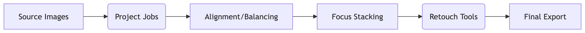

# Graphical User Intreface

## Introduction

FocusStack GUI processes focus-bracketed images in two phases:

* Project (batch processing)
* Retouch (layer-based refinement)"

The batch processing supports image alignment, color and luminosity balance, vignetting removal,
noisy picel masking. See (the main documentation)[main.md] for more details about details and installation.

## Starting

* If the python package is donwloaded and installed, the GUI can start either from a console command line :

```console
> focusstack
```

* If the app is dowloaded from the (releases page)[https://github.com/lucalista/focusstack/releases], after the  ```zip``` archive is uncompressed, the user can just double-click the app icon:


**Platform Tip**: Windows apps are inside `/focusstack/`, macOS/Linux apps are directly in the uncompressed folder.

The GUI has two main working areas: 

* *Project* 
* *Retouch*

Switcing from *Project* to *Retouch* can be done from the *FocusStack* main menu.

## Project area

When the app starts, it proposes to create a new project.


### Creating a new project
1. Select source folder (JPEG/TIFF, 8/16-bit)
2. Intermediate folders auto-create in parent directory
3. Configure job actions (alignment/balancing/...)




Up to 100 images or more can be processed, but consider that combining multiple images may require
large amout of RAM. It may be more convenient, and also more practical, to combine *bunches*
of 10 to 15 images, and then fuse the interemediate images into the final focus-stacked image.
This option is supported. It is possible to specify the number of frames per bunch, and how many
frames of each bunch overlap with the following one.

The newly created project consists in a single job that contains more actions.
Each action produces a folder as output that has, by default, the action's name.
Some actions can be combined in order to produce a single intermediate output.
This is the case for alignment, balancing, etc.

> **Pro Tip**: Duplicate jobs when processing similar image sets to save configuration time. 

It is possible to run a single job, or all jobs within a project.


During processing:

* Real-time logs appear in new tab
* Progress bar shows current action
* Thumbnails generate for completed stages

Different actions can optionally display istograms or other intermediate results.

When the job finishes, a *Retouch* button is enabled, which opens the output image into the retouch area.

## Retouch area


In the retouch area it is possible to apply the final correction to the stacked image.

By default, the stacked frames together with the focus-stacked image are opened.

Using a configurable brush, it is possible to copy small areas from a specific layer, including
the focus-stacked image, to the master layer in order to correct small decects, like dust grains
in front of the main subject, artifacts and so on.

The retouched master image can be saved either individually or as multilayer TIFF file (in general
much heavier) for further editing. It is also possible to manually import source layers in case
the user prefers to avoid managing heavy TIFF files.

## Final retouch

The final retouch, including color and luminosity balance, sharpness enhancement and
so on can be applied with your favurite image processing application, like [GIMP](https://www.gimp.org/)
or other.

