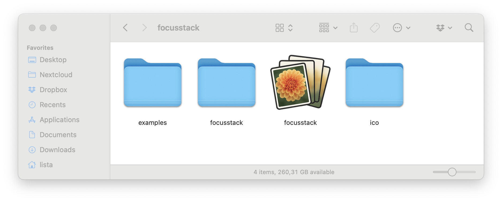
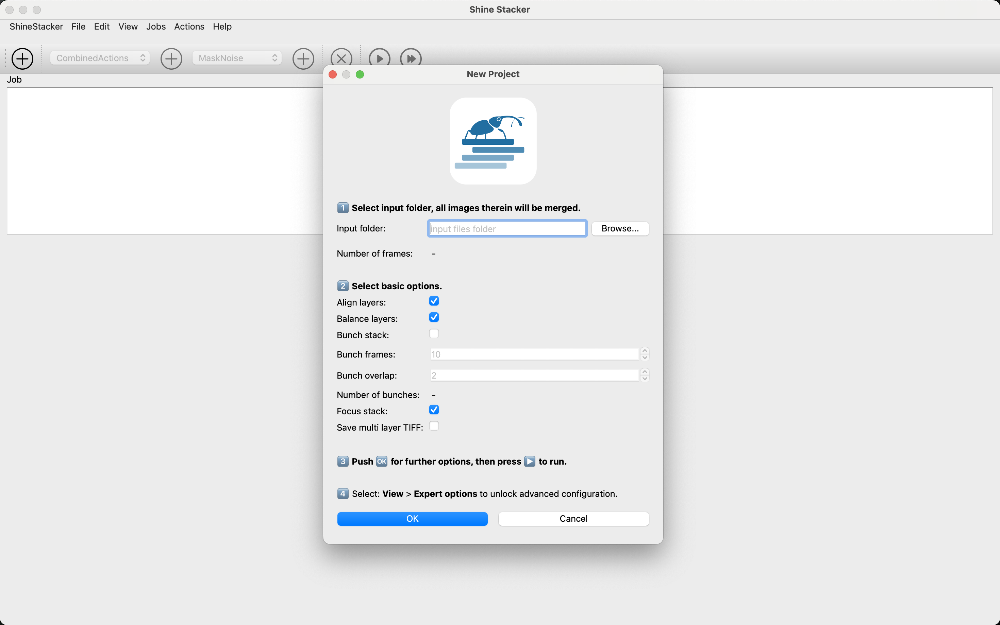
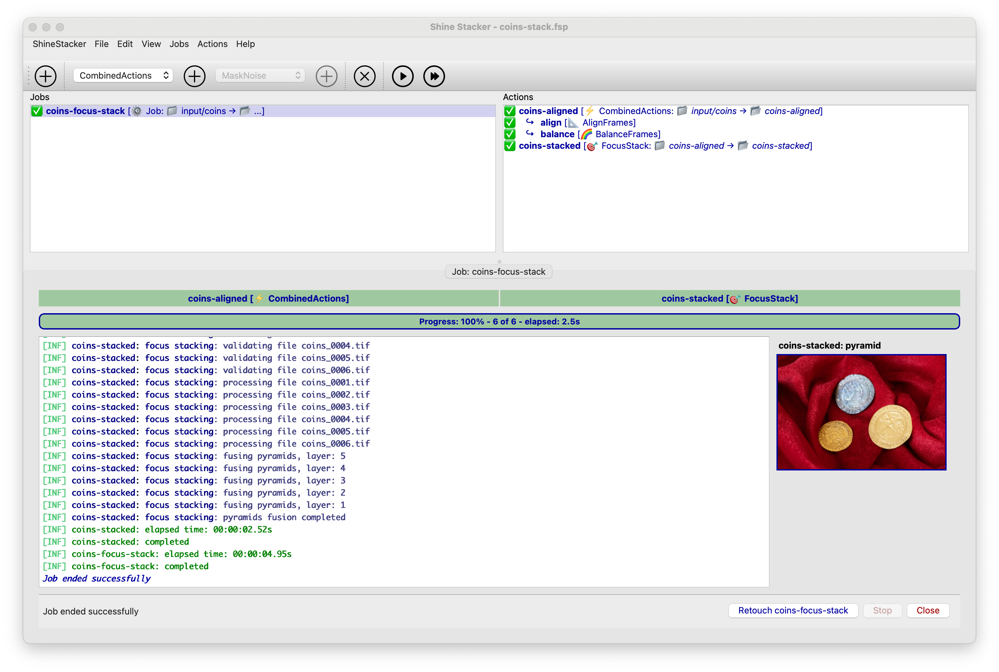
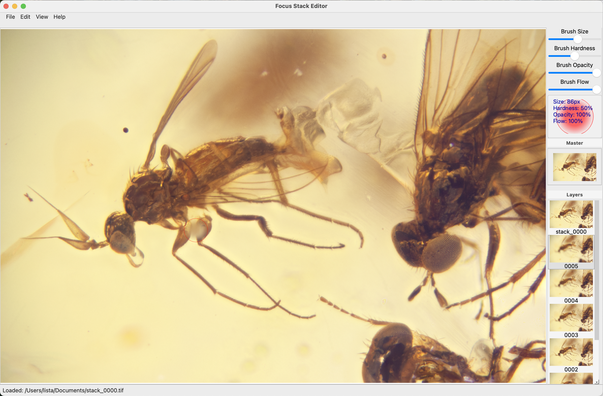

### Graphical User Intreface

The GUI can start either from a console command line if the python package is donwloaded and installed:

```console
> focusstack
```

If the app is dowloaded from the (releases page)[https://github.com/lucalista/focusstack/releases], after the  ```zip``` archive is uncompressed, the user can just double-click the app icon:



Note that under Windows the app is located inside the *focusstack* folder.

The GUI has two main working areas: *Project* and *Retouch*. 
Switcing from *Project* to *Retouch* can be done with the *FocusStack* main menu.

## Project area

When the app starts, it proposes to create a new project.



The first thing to do is to select the folder that contains the source images, 
that can be either in jpeg or tiff format, but with 8 bit or 16 bit depth.

More folders will be created with intermediate processing stages, located in the same parent folder
that contains the selected source image folder.

The newly created project consists in a single job that contains more actions.
Each action produces a folder as output that has, by default, the action's name.
Some actions can be combined in order to produce a single intermediate output.
This is the case for alignment, balancing, etc.

More jobs can be added within the same project. For instance, if the same processing has
to be applied to multiple source folders, a job can be duplicated and the input folder can be
modifed in each folder.

It is possible to run a single job, or all jobs within a project.



When the job runs, a log tab is created and the running can be monitored.

When intermediate results are provided, optionally clickable thumbnail are shown, like in the above image.

Different actions can optionally display istograms or other intermediate results.

When the job finishes, a *Retouch* button is enabled, which opens the output image into the retouch area.

## Retouch area



In the retouch area it is possible to apply the final correction to the stacked image.

By default, the stacked frames together with the focus-stacked image are opened.

Using a configurable brush, it is possible to copy small areas from a specific layer, including
the focus-stacked image, to the master layer in order to correct small decects, like dust grains
in front of the main subject, artiefacts and so on.

The retouched master image can be saved either individually or as multilayer TIFF file (in general
much heavier) for further editing. It is also possible to manually import source layers in case
the user prefers to avoid managing heavy TIFF files.

## Final retouch

The final retouch, including color and luminosity balance, sharpness enhancement and
so on can be applied with your favurite image processing application, like [GIMP](https://www.gimp.org/)
or other.

