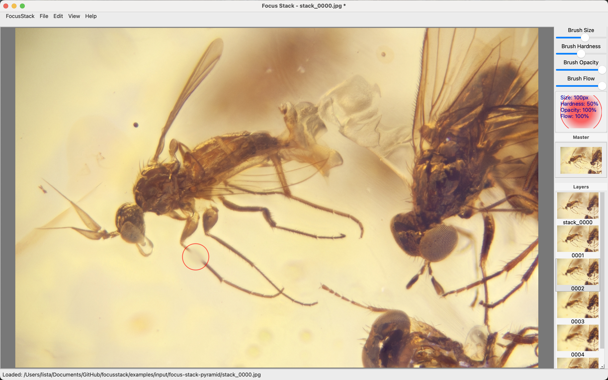

# Focus Stacking Processing Framework

  

## Quick Start
```python
from algorithms import *

job = StackJob("demo", "/path/to/images", input_path="src")
job.add_action(CombinedActions("align", [AlignFrames()]))
job.add_action(FocusStack("result", PyramidStack()))
job.run()
```

## Usage example

```python
from algorithms import *

job = StackJob("job", "E:/Focus stacking/My image directory/", input_path="src")
job.add_action(NoiseDetection())
job.run()

job = StackJob("job", "E:/Focus stacking/My image directory/", input_path="src")
job.add_action(CombinedActions("align",
			       [MaskNoise(),Vignetting(), AlignFrames(),
                                BalanceFrames(mask_size=0.9,
                                              intensity_interval={'min': 150, 'max': 65385})]))
job.add_action(FocusStackBunch("batches", PyramidStack(), frames=10, overlap=2, denoise=0.8))
job.add_action(FocusStack("stack", PyramidStack(), postfix='_pyramid', denoise=0.8))
job.add_action(FocusStack("stack", DepthMapStack(), input_path='batches', postfix='_depthmap', denoise=0.8))
job.add_action(MultiLayer("multilayer", input_path=['batches', 'stack']))
job.run()
```

if some constants have to be used in the configuration, the set of predefined constants should be imported:
```python
from config.constants import constants
```

## Jupyter notebooks

Examples in jupyter notebooks are provided.

Running in jupyter notebook requires the following packages:
* ipywidgets

## Graphical User Interface

A GUI based on ```PySide6``` is also available, still experimental and undocumented.
It basically reflects the structure of the python modules documented below, with the corresponding configurable parameterrs.

Multulayer TIFF files generated by the ```MultiLayer``` module can be edidted for the final manual retouch.

To run the GUI, from the main package directory run:

```console
python -m app.main
```




The GUI requires the following python modules:
* ansi2html
* jsonpickle
* PySide6
* webbrowser

## Documentation
- [Job creation and processing pipeline](../docs/job.md)
- [Image alignment](../docs/alignment.md)
- [Luminosity and color balancing](../docs/balancing.md)
- [Stacking algorithms](../docs/focus_stacking.md)
- [Multilayer image](../docs/multilayer.md)
- [Noisy pixel masking](../docs/noise.md)
- [Vignetting correction](../docs/vignetting.md)

## Requirements

* python version 3.12. With python 3.13, when closing the applications, it crashes in in the garbage colleciton phase for an unknown reason.

The following python modules:
* imagecodecs
* matplotlib
* numpy
* opencv-python
* pillow
* psdtags
* scipy
* termcolor
* tifffile
* tqdm

## Installation
The package lacks a real installation setup. It will be possibly developed at a later stage.

You can clone the pagkage from GitHub:

```bash
pip install git+https://github.com/lucalista/focusstack.git
```
## Issues

* Balance modes ```BALANCE_HSV``` and ```BALANCE_HLS``` are only supported for 8-bit images
* Focus stacking modules crashes for TIFF files if  ```denoise``` is set different from zero due to an assertion failure in the Open CV library. This is similar to a [known issue on stackoverflow](https://stackoverflow.com/questions/76647895/opencv-fastnlmeansdenoisingmulti-should-support-16-bit-images-but-does-it).
* PNG files have not been tested so far.
